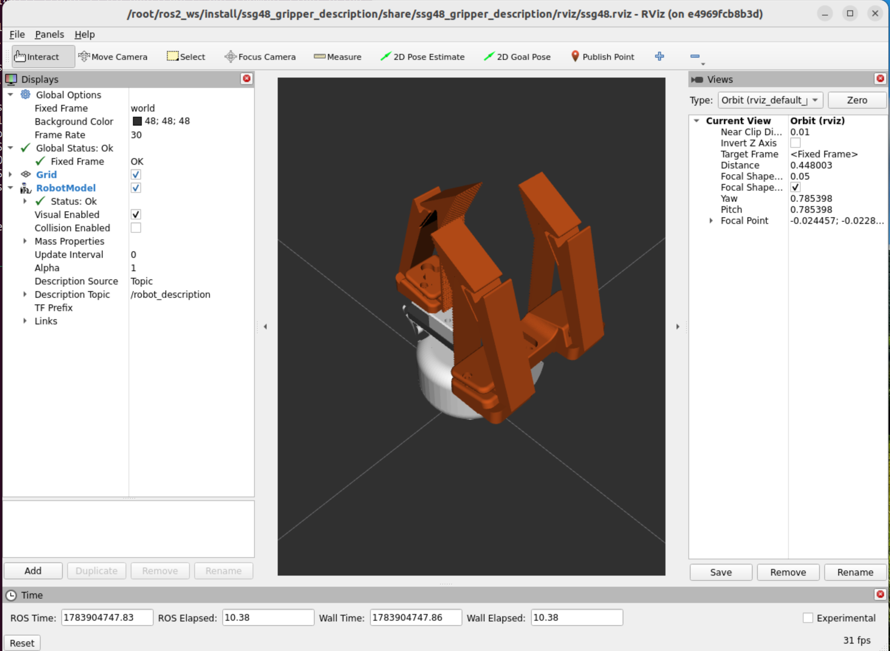

# ROS2 Humble Package for the SSG48 Gripper with PacomeFlex Soft Fingers



ROS2 Humble package for the [Source Robotics SSG48 adaptive electric gripper](https://github.com/PCrnjak/SSG-48-adaptive-electric-gripper), fitted with custom **PacomeFlex** soft fingers.

Fork of [Lass6230/ssg48_adaptive_electric_gripper_ros2](https://github.com/Lass6230/ssg48_adaptive_electric_gripper_ros2).

Changes with respect to upstream:

- Custom asymmetric **PacomeFlex** soft fingers: meshes, dedicated xacro macro, and a `finger_type` launch/xacro argument (`standard`, `adaptive`, `pacomeflex`) replacing the former `standard_fingers` boolean
- Repaired launch files: proper xacro processing with argument passthrough, working `use_rviz` flag, RViz configuration loaded automatically (`rviz/ssg48.rviz`)
- Miscellaneous fixes: `rclpy` dependency typo in `package.xml`, mesh unit scaling (mm to m) and mesh frame correction parameters

## Installation

```bash
sudo apt update
sudo apt install ros-humble-control-msgs ros-humble-xacro \
  ros-humble-joint-state-publisher ros-humble-joint-state-publisher-gui \
  ros-humble-robot-state-publisher ros-humble-turtlesim \
  can-utils iproute2 liburdfdom-tools python3-pip
pip install python-can Spectral-BLDC

mkdir -p ~/ros2_ws/src
cd ~/ros2_ws/src
git clone https://github.com/lionelbirglen/SSG48_PacomeFlex_ROS2.git
cd ..
colcon build --symlink-install
source install/setup.bash
```

## CAN connection

The USB-CAN adapter used with this package operates in **slcan** mode and appears as a serial device (e.g. `/dev/ttyACM0`). No CAN interface setup is needed. Inside Docker, pass the device to the container with `--device=/dev/ttyACM0:/dev/ttyACM0`.

Only one process can hold the serial device at a time: close any other application using it (e.g. `Gripper_GUI.py`) before launching the ROS2 driver.

Alternatively, socketcan adapters (candleLight/gs_usb appearing as `can0`) are also supported: bring the interface up with `sudo ip link set dev can0 up type can bitrate 1000000` and launch with `bustype:=socketcan channel:=can0` (inside Docker this requires `--network host`).

Note: the SSG48 is internally CAN-terminated; add the second 120 ohm termination only at the USB adapter end.

## Hardware sanity check (before ROS2)

Before involving ROS2, verify that the gripper and the CAN adapter work with the standalone GUI from Source Robotics, vendored in `tools/SSG-gripper-GUI`:

```bash
cd ~/ros2_ws/src/SSG48_PacomeFlex_ROS2/
pip install -r tools/SSG-gripper-GUI/requirements.txt
python3 tools/SSG-gripper-GUI/Gripper_GUI.py
```

Connect the gripper, then in the GUI:

1. Set the COM port (default: `/dev/ttyACM0`)
2. Click **Connect**
3. Click **Calibrate** <br> 
**Warning: This button runs the gripper jaw calibration — the fingers will sweep their full stroke. Keep the workspace clear.**
4. Click **Activate**
5. Set position, speed, and current values with the sliders
6. Click **Deactivate** to stop

Note: there might be too much friction at certain positions for the gripper to complete the motion. Set the current to 500mA instead of 300mA will solve this issue.

If this works, the hardware chain (gripper, wiring, adapter, serial passthrough) is good and any remaining problem is on the ROS2 side.

Inside Docker, the GUI needs X11 forwarding (`-e DISPLAY -v /tmp/.X11-unix:/tmp/.X11-unix` on the `docker run` command). Close the GUI before launching the ROS2 driver: only one process can hold the serial device.

## Launching the driver

**Warning: the driver node runs the gripper jaw calibration automatically at startup — the jaws sweep their full stroke on every launch. Keep the workspace clear.**

```bash
source ~/ros2_ws/install/setup.bash
ros2 launch ssg48_gripper ssg48_gripper.launch.py bustype:=slcan channel:=/dev/ttyACM0 bitrate:=1000000 default_speed:=30
```

Useful arguments (with defaults):

- `finger_type:=pacomeflex` — finger variant: `standard`, `adaptive`, or `pacomeflex`
- `default_speed:=100` — speed (0-255) used by the GripperCommand action, which carries no speed field; `30` to `150` is the recommended value range for the pacomeflex fingers
- `use_rviz:=True` — set to `False` on a headless robot
- `rviz_config:=<path>` — RViz layout, defaults to the packaged `rviz/ssg48.rviz`

## Actions

Custom actions plus the standard `control_msgs/action/GripperCommand` (the interface MoveIt's gripper controller expects) and node run:

```bash
# source ros2 workspace if needed
source ~/ros2_ws/install/setup.bash

# recalibrate jaw endpoints
ros2 action send_goal /ssg48_gripper/homing ssg48_gripper_msgs/action/Homing {}

# position move: width [m] (0 = closed, 0.048 = fully open), speed [m/s]
ros2 action send_goal -f /ssg48_gripper/move ssg48_gripper_msgs/action/Move "{width: 0.048, speed: 0.02}"

# standard gripper interface
ros2 action send_goal /gripper_command control_msgs/action/GripperCommand "{command: {position: 0.012, max_effort: 10.0}}"

# force-limited grasp (***recommended***)
ros2 action send_goal -f /ssg48_gripper/grasp ssg48_gripper_msgs/action/Grasp "{width: 0.02, speed: 0.02, force: 25.0, epsilon: 0.01}"

# running the gripper node at set default speed
ros2 run ssg48_gripper ssg48_gripper --ros-args -p default_speed:=100
```

Notes on `Grasp`:

- `epsilon` [m] is the allowed deviation between final and requested width for the grasp to count as a success; setting `width` to the expected object size turns this into object-presence detection (no object: the jaws pass the epsilon band and the action fails).
- `force` [N] is converted to a motor current limit through a linear map calibrated on the stock motor (approximately 0.046 N/mA, valid 20-50 N); it is an open-loop estimate, not a measured force. The gripper keeps squeezing at that current after the action returns, which heats the motor: for long holds, use the lowest force that retains the object. **A value of 25 is recommended to avoid motion jams**

Joint state feedback is published on `gripper_joint_states` and merged into `/joint_states` and TF.

## Visualization without hardware

Model inspection and mesh alignment with slider control of the finger joint:

```bash
ros2 launch ssg48_gripper_description ssg48_gripper_description.launch.py finger_type:=pacomeflex
```

## Repository structure

```
.
├── README.md
├── docs/
│   └── images/                       Illustrations used by this README
├── ssg48_gripper/                    ROS2 driver package (ament_python)
│   ├── launch/                       Main launch file (driver + RViz + state publishers)
│   └── ssg48_gripper/                rclpy driver node (CAN via python-can / Spectral-BLDC)
├── ssg48_gripper_description/        ROS2 model package (ament_cmake)
│   ├── launch/                       Hardware-free visualization launch (joint sliders + RViz)
│   ├── meshes/                       STL meshes: stock gripper + PacomeFlex fingers
│   ├── rviz/                         Saved RViz configuration loaded by both launch files
│   └── urdf/                         xacro description: gripper, stock and PacomeFlex finger variants
├── ssg48_gripper_msgs/               ROS2 interface package
│   └── action/                       Homing, Move, and Grasp action definitions
├── sandbox/                           mc_rtc / Choreonoid integration (not a ROS2 package)
│   ├── to do...
└── tools/
    └── SSG-gripper-GUI/              Vendored Source Robotics GUI (not a ROS package),
                                      used for the hardware sanity check
```

The `sandboxc/` subtree is not part of the ROS2 workspace. It targets the [mc_rtc](https://jrl-umi3218.github.io/mc_rtc/) control framework for building and using the plugin that connects an mc_rtc controller to the ROS2 gripper driver.

## Troubleshooting and Tips

- the usb-can adapter used with gripper is not good, the USB-C connector sometimes does not engage well/completely, if CAN Bus is unresponsive (no lights on the adapter) **replug until all three leds light up** and the /dev/ttyACM* port appears on the host machine.
- be wary of overheating the motor. For instance, avoid commanding an extreme positions for the gripper for too long (ie. fully open/close positions) as the position controller embedded in the gripper and driving its motor might try to keep pushing against the mechanical limit of the jaws (alternatively use the epsilon tolerance of the ros2 action to avoid this issue). On the other hand, keeping the gripper plugged but not actively controlling a precise position is unproblematic, it can be kept like that for hours without issue, the jaws are also backdriveable to you can move them by hand.
- watch when the gripper calibrates: it must move to **both** the fully open and fully close position. Sometimes because of friction it reaches only one of these two positions and fails to move the second one. The Source Robotics driver then reports calibration as a success but **it is not true!** The calibration actually failed and the gripper motion will be erratic (e.g. it will noisingly vibrates instead of moving). Deactivate the gripper (python) or stop the ROS2 node, move the fingers manually in an intermediary position, and relaunch calibration. These steps usually solve the issue. Putting a little bit of oil (blue canister) on the rail and moving the fingers over the complete range of motion by hand a couple of times also helps. Note: after calibration the gripper must be fully closed.
- you can mount a different arrangements of soft and rigid adaptive fingers on the grippers, e.g. two rigid ones, two + two soft ones, one + one soft ones, etc. There are extra fingers and spare parts in one of the gripper boxes.

## License

Original ROS2 package by Lass6230; SSG48 gripper and Spectral BLDC driver by Source Robotics / Petar Crnjak; PacomeFlex soft fingers, Pacone rigid fingers, MC-RTC plugin and ROS2 fork modifications by Lionel Birglen, Polytechnique Montréal (all rights reserved on the Pacome and PacomeFlex additions; upstream components remain under their original licenses).
